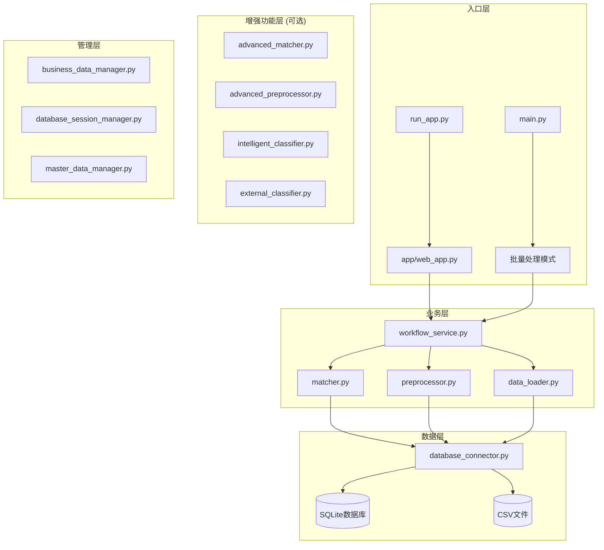
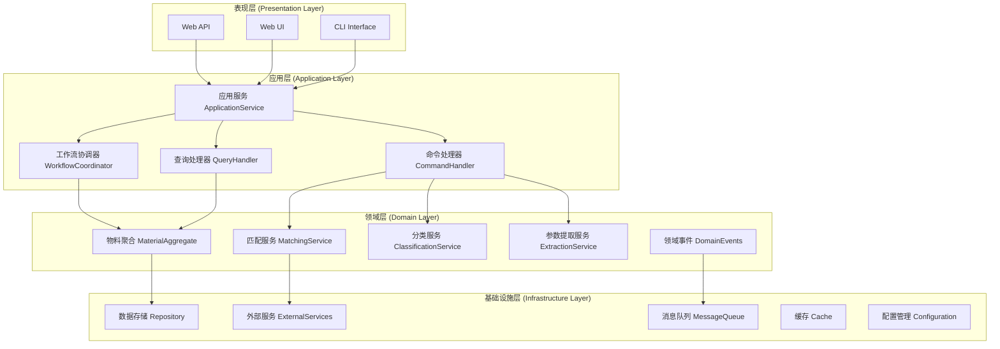

# MMP系统架构重构与迭代计划

> **文档版本**: v1.0  
> **创建日期**: 2025年9月22日  
> **目标**: 基于现有系统结构，制定渐进式架构升级和智能化增强计划

## 📋 目录
- [1. 现状分析](#1-现状分析)
- [2. 架构重构设计](#2-架构重构设计)
- [3. 渐进式升级路线图](#3-渐进式升级路线图)
- [4. 技术债务处理](#4-技术债务处理)
- [5. 性能优化策略](#5-性能优化策略)
- [6. 扩展性设计](#6-扩展性设计)
- [7. 风险评估与应对](#7-风险评估与应对)

---

## 1. 现状分析

### 🏗️ 当前系统架构概览



### 📊 模块依赖分析

| 模块 | 依赖关系 | 职责 | 问题 |
|------|---------|------|------|
| **web_app.py** | workflow_service, 各manager | Web界面和API | 🔴 代码过长(2000+行)，职责混乱 |
| **workflow_service.py** | matcher, preprocessor, data_loader | 核心业务流程 | 🟡 缺乏清晰的状态管理 |
| **matcher.py** | database_connector | 匹配算法 | 🟡 算法相对简单 |
| **preprocessor.py** | - | 数据预处理 | 🟢 职责清晰 |
| **data_loader.py** | database_connector | 数据加载 | 🟡 格式支持有限 |
| **database_connector.py** | SQLite | 数据库操作 | 🟡 缺乏连接池和事务管理 |

### 🚨 主要技术债务

1. **架构债务**
   - ❌ 缺乏清晰的分层架构
   - ❌ 模块间耦合度高
   - ❌ 没有统一的接口规范

2. **代码债务**
   - ❌ `web_app.py` 文件过大，违反单一职责原则
   - ❌ 大量硬编码配置
   - ❌ 异常处理不统一

3. **数据债务**
   - ❌ 数据库表结构不规范
   - ❌ 缺乏数据版本管理
   - ❌ 会话数据管理混乱

4. **测试债务**
   - ❌ 单元测试覆盖率低
   - ❌ 缺乏集成测试
   - ❌ 没有自动化测试流程

---

## 2. 架构重构设计

### 🎯 重构目标

1. **清晰分层**: 建立标准的分层架构（表现层、应用层、领域层、基础设施层）
2. **高内聚低耦合**: 模块职责明确，接口清晰
3. **易于扩展**: 支持插件化和微服务化演进
4. **高性能**: 优化数据访问和计算效率
5. **可维护**: 代码结构清晰，文档完善

### 🏛️ 新架构设计



### 📁 新目录结构

```
mmp/
├── 📁 src/                          # 源代码目录
│   ├── 📁 presentation/             # 表现层
│   │   ├── 📁 web/                  # Web界面
│   │   │   ├── api_router.py        # API路由
│   │   │   ├── web_controller.py    # Web控制器
│   │   │   └── middleware.py        # 中间件
│   │   └── 📁 cli/                  # 命令行界面
│   │       └── cli_app.py
│   │
│   ├── 📁 application/              # 应用层
│   │   ├── 📁 services/             # 应用服务
│   │   │   ├── material_service.py  # 物料服务
│   │   │   ├── workflow_service.py  # 工作流服务
│   │   │   └── user_service.py      # 用户服务
│   │   ├── 📁 handlers/             # 处理器
│   │   │   ├── command_handlers.py  # 命令处理器
│   │   │   └── query_handlers.py    # 查询处理器
│   │   └── 📁 dto/                  # 数据传输对象
│   │       └── material_dto.py
│   │
│   ├── 📁 domain/                   # 领域层
│   │   ├── 📁 entities/             # 实体
│   │   │   ├── material.py          # 物料实体
│   │   │   └── category.py          # 分类实体
│   │   ├── 📁 services/             # 领域服务
│   │   │   ├── matching_service.py  # 匹配服务
│   │   │   ├── classification_service.py  # 分类服务
│   │   │   └── extraction_service.py      # 提取服务
│   │   ├── 📁 repositories/         # 仓储接口
│   │   │   └── material_repository.py
│   │   └── 📁 events/               # 领域事件
│   │       └── material_events.py
│   │
│   └── 📁 infrastructure/           # 基础设施层
│       ├── 📁 database/             # 数据库
│       │   ├── repositories/        # 仓储实现
│       │   ├── migrations/          # 数据库迁移
│       │   └── connection.py        # 连接管理
│       ├── 📁 external/             # 外部服务
│       │   └── api_clients.py
│       ├── 📁 cache/                # 缓存
│       │   └── redis_cache.py
│       └── 📁 config/               # 配置
│           └── settings.py
│
├── 📁 tests/                        # 测试目录
│   ├── 📁 unit/                     # 单元测试
│   ├── 📁 integration/              # 集成测试
│   └── 📁 e2e/                      # 端到端测试
│
├── 📁 docs/                         # 文档目录
├── 📁 scripts/                      # 脚本目录
├── 📁 deploy/                       # 部署配置
└── 📁 static/                       # 静态资源
    ├── templates/                   # 模板文件
    └── assets/                      # 静态资产
```

---

## 3. 渐进式升级路线图

### 🚀 Phase 0: 准备阶段 (1周)

**目标**: 现状梳理和环境准备

**任务清单**:
- [ ] **代码审计**: 全面分析现有代码质量和技术债务
- [ ] **依赖梳理**: 分析模块间依赖关系，绘制依赖图
- [ ] **数据迁移**: 备份现有数据，设计新数据库结构
- [ ] **测试基准**: 建立性能基准测试，记录当前系统表现
- [ ] **环境搭建**: 准备开发、测试、生产环境

**验收标准**:
- ✅ 完成代码质量报告
- ✅ 绘制完整的模块依赖图
- ✅ 数据备份完成，新表结构设计确认
- ✅ 性能基准数据收集完毕

### 🏗️ Phase 1: 基础设施重构 (2-3周)

**目标**: 建立新的基础架构，确保向后兼容

#### Week 1: 配置和数据层重构
```python
# 新配置管理系统
class ConfigurationManager:
    """统一配置管理"""
    def __init__(self):
        self.config_sources = [
            EnvConfigSource(),      # 环境变量
            FileConfigSource(),     # 配置文件
            DatabaseConfigSource()  # 数据库配置
        ]
    
    def get(self, key: str, default=None):
        """获取配置值，支持多层级覆盖"""
        pass

# 新数据库层设计
class DatabaseManager:
    """数据库连接和事务管理"""
    def __init__(self, config: ConfigurationManager):
        self.connection_pool = ConnectionPool(config)
        self.transaction_manager = TransactionManager()
    
    async def execute(self, query: str, params: Dict):
        """执行数据库操作"""
        pass

# 新仓储模式实现
class MaterialRepository:
    """物料数据仓储"""
    def __init__(self, db_manager: DatabaseManager):
        self.db = db_manager
    
    async def find_by_id(self, material_id: str) -> Material:
        """根据ID查找物料"""
        pass
    
    async def save(self, material: Material) -> bool:
        """保存物料"""
        pass
```

#### Week 2: 领域层重构
```python
# 物料领域实体
@dataclass
class Material:
    """物料实体"""
    id: str
    name: str
    specification: str
    manufacturer: str
    category: Optional[Category] = None
    
    def classify(self, classifier: 'ClassificationService') -> 'ClassificationResult':
        """执行分类"""
        return classifier.classify(self)
    
    def extract_parameters(self, extractor: 'ExtractionService') -> Dict[str, Any]:
        """提取参数"""
        return extractor.extract(self)

# 分类领域服务  
class ClassificationService:
    """分类服务"""
    def __init__(self, strategies: List[ClassificationStrategy]):
        self.strategies = strategies
    
    def classify(self, material: Material) -> ClassificationResult:
        """执行分类逻辑"""
        results = []
        for strategy in self.strategies:
            result = strategy.classify(material)
            results.append(result)
        return self._aggregate_results(results)
```

#### Week 3: 应用层重构
```python
# 应用服务
class MaterialApplicationService:
    """物料应用服务"""
    def __init__(
        self,
        material_repo: MaterialRepository,
        classification_service: ClassificationService,
        event_publisher: EventPublisher
    ):
        self.material_repo = material_repo
        self.classification_service = classification_service
        self.event_publisher = event_publisher
    
    async def classify_material(self, request: ClassifyMaterialRequest) -> ClassifyMaterialResponse:
        """分类物料"""
        # 1. 获取物料
        material = await self.material_repo.find_by_id(request.material_id)
        
        # 2. 执行分类
        result = material.classify(self.classification_service)
        
        # 3. 保存结果  
        material.category = result.category
        await self.material_repo.save(material)
        
        # 4. 发布事件
        await self.event_publisher.publish(MaterialClassifiedEvent(material, result))
        
        return ClassifyMaterialResponse(material, result)
```

**验收标准**:
- ✅ 新配置系统正常工作，支持多环境配置
- ✅ 数据库连接池和事务管理稳定运行  
- ✅ 核心领域实体和服务重构完成
- ✅ 应用服务层基本框架搭建完成
- ✅ 保持现有API向后兼容

### ⚡ Phase 2: 业务逻辑迁移 (3-4周)

**目标**: 逐步迁移现有业务逻辑到新架构

#### Week 1-2: 核心功能迁移
- [ ] **物料匹配逻辑迁移**: 将现有matcher.py逻辑迁移到新的MatchingService
- [ ] **数据预处理迁移**: 将preprocessor.py逻辑整合到新的ExtractionService
- [ ] **工作流重构**: 重新设计WorkflowService，支持异步处理

#### Week 3-4: 高级功能迁移
- [ ] **智能分类器迁移**: 将intelligent_classifier.py迁移到新框架
- [ ] **外部分类器集成**: 重构external_classifier.py，支持插件化
- [ ] **会话管理重构**: 建立统一的会话和状态管理

**迁移策略**:
```python
# 逐步迁移策略 - 适配器模式
class LegacyMatcherAdapter:
    """传统匹配器适配器"""
    def __init__(self, legacy_matcher, new_matching_service):
        self.legacy_matcher = legacy_matcher
        self.new_service = new_matching_service
    
    def match(self, material: Material) -> MatchResult:
        """逐步切换到新服务"""
        if self._should_use_new_service():
            return self.new_service.match(material)
        else:
            return self._adapt_legacy_result(
                self.legacy_matcher.match(material.to_legacy_format())
            )
```

### 🤖 Phase 3: 智能化增强 (4-5周)

**目标**: 集成AI/ML能力，实现智能化升级

#### Week 1-2: 基础AI框架
- [ ] **ML管道搭建**: 建立训练、推理、评估的完整ML管道
- [ ] **特征工程**: 实现自动化特征提取和选择
- [ ] **模型管理**: 建立模型版本管理和A/B测试系统

#### Week 3-4: 智能功能实现
- [ ] **智能分类**: 基于深度学习的分类算法
- [ ] **智能匹配**: 语义相似度匹配和推荐系统
- [ ] **参数提取**: NLP驱动的参数自动提取

#### Week 5: 强化学习集成
- [ ] **RL框架集成**: 参考`INTELLIGENT_CLASSIFICATION_ENHANCEMENT_DESIGN.md`
- [ ] **用户反馈循环**: 实现在线学习和模型更新
- [ ] **多目标优化**: 平衡准确性、效率和用户满意度

```python
# 智能化服务架构
class EnhancedClassificationService:
    """增强分类服务"""
    def __init__(
        self,
        ml_pipeline: MLPipeline,
        rl_agent: ReinforcementLearningAgent,
        fallback_service: ClassificationService
    ):
        self.ml_pipeline = ml_pipeline
        self.rl_agent = rl_agent
        self.fallback_service = fallback_service
    
    async def classify(self, material: Material, session_context: SessionContext) -> ClassificationResult:
        """智能分类"""
        try:
            # 1. ML预测
            ml_result = await self.ml_pipeline.predict(material)
            
            # 2. RL优化
            if self.rl_agent.should_intervene(ml_result, session_context):
                rl_result = await self.rl_agent.optimize(ml_result, session_context)
                return rl_result
            
            return ml_result
            
        except Exception:
            # 3. 降级到基础服务
            return await self.fallback_service.classify(material)
```

### 🌐 Phase 4: 性能优化与扩展 (2-3周)

**目标**: 系统性能优化和扩展性增强

#### Week 1: 性能优化
- [ ] **缓存策略**: Redis集成，多级缓存
- [ ] **数据库优化**: 索引优化，查询优化
- [ ] **异步处理**: 消息队列集成，批处理优化

#### Week 2-3: 扩展性增强  
- [ ] **微服务拆分**: 核心服务模块化
- [ ] **API网关**: 统一API入口和版本管理
- [ ] **监控体系**: 完善的监控、告警和日志系统

### 📋 Phase 5: 测试完善与文档 (1-2周)

**目标**: 完善测试体系和文档

- [ ] **测试覆盖**: 单元测试覆盖率达到80%+
- [ ] **集成测试**: 端到端测试自动化
- [ ] **压力测试**: 性能测试和容量规划
- [ ] **文档完善**: API文档、架构文档、运维文档

---

## 4. 技术债务处理

### 🔧 代码质量提升

#### 4.1 web_app.py重构计划
```python
# 当前问题: 2000+行巨型文件
# 解决方案: 按功能拆分

# 新结构:
src/presentation/web/
├── controllers/
│   ├── material_controller.py     # 物料相关接口
│   ├── workflow_controller.py     # 工作流接口  
│   ├── admin_controller.py        # 管理接口
│   └── api_controller.py          # API接口
├── middleware/
│   ├── auth_middleware.py         # 认证中间件
│   ├── logging_middleware.py      # 日志中间件
│   └── error_middleware.py        # 错误处理中间件
├── validators/
│   └── request_validators.py      # 请求验证
└── app_factory.py                 # Flask应用工厂
```

#### 4.2 配置管理优化
```python
# 当前问题: 硬编码配置分散
# 解决方案: 分层配置管理

class Settings:
    """分层配置管理"""
    
    # 基础配置
    APP_NAME: str = "MMP"
    VERSION: str = "2.0.0"
    
    # 数据库配置
    DATABASE_URL: str = Field(..., env="DATABASE_URL")
    DATABASE_POOL_SIZE: int = Field(default=10, env="DB_POOL_SIZE")
    
    # ML配置
    ML_MODEL_PATH: str = Field(..., env="ML_MODEL_PATH")
    ML_BATCH_SIZE: int = Field(default=32, env="ML_BATCH_SIZE")
    
    # 缓存配置
    REDIS_URL: str = Field(..., env="REDIS_URL")
    CACHE_TTL: int = Field(default=3600, env="CACHE_TTL")
    
    class Config:
        env_file = ".env"
        case_sensitive = False
```

### 🗄️ 数据库重构

#### 4.3 数据库表结构优化
```sql
-- 新的标准化表结构

-- 物料主表
CREATE TABLE materials (
    id UUID PRIMARY KEY DEFAULT gen_random_uuid(),
    name VARCHAR(255) NOT NULL,
    specification TEXT,
    manufacturer_id UUID REFERENCES manufacturers(id),
    category_id UUID REFERENCES categories(id),
    brand VARCHAR(100),
    model VARCHAR(100),
    status VARCHAR(20) DEFAULT 'active',
    created_at TIMESTAMP DEFAULT NOW(),
    updated_at TIMESTAMP DEFAULT NOW(),
    version INTEGER DEFAULT 1
);

-- 分类表
CREATE TABLE categories (
    id UUID PRIMARY KEY DEFAULT gen_random_uuid(),
    code VARCHAR(50) UNIQUE NOT NULL,
    name VARCHAR(255) NOT NULL,
    parent_id UUID REFERENCES categories(id),
    level INTEGER NOT NULL,
    path TEXT, -- 分类路径
    features JSONB, -- 分类特征
    created_at TIMESTAMP DEFAULT NOW()
);

-- 制造商表  
CREATE TABLE manufacturers (
    id UUID PRIMARY KEY DEFAULT gen_random_uuid(),
    name VARCHAR(255) NOT NULL,
    code VARCHAR(50) UNIQUE,
    country VARCHAR(50),
    created_at TIMESTAMP DEFAULT NOW()
);

-- 匹配记录表
CREATE TABLE matching_records (
    id UUID PRIMARY KEY DEFAULT gen_random_uuid(),
    session_id UUID NOT NULL,
    material_id UUID REFERENCES materials(id),
    match_type VARCHAR(50), -- exact, fuzzy, ml, rl
    confidence DECIMAL(3,2),
    algorithm_version VARCHAR(20),
    user_feedback INTEGER, -- 1-5评分
    created_at TIMESTAMP DEFAULT NOW()
);

-- 用户反馈表
CREATE TABLE user_feedback (
    id UUID PRIMARY KEY DEFAULT gen_random_uuid(),
    session_id UUID NOT NULL,
    material_id UUID REFERENCES materials(id),
    action_type VARCHAR(50), -- classification, matching, extraction
    original_result JSONB,
    corrected_result JSONB,
    satisfaction_score INTEGER, -- 1-5
    comment TEXT,
    created_at TIMESTAMP DEFAULT NOW()
);
```

### 🚨 异常处理标准化
```python
# 统一异常处理体系
class MMPException(Exception):
    """MMP系统基础异常"""
    def __init__(self, message: str, error_code: str = None, details: Dict = None):
        self.message = message
        self.error_code = error_code
        self.details = details or {}
        super().__init__(self.message)

class MaterialNotFoundException(MMPException):
    """物料未找到异常"""
    pass

class ClassificationException(MMPException):
    """分类异常"""
    pass

# 全局异常处理器
@app.errorhandler(MMPException)
def handle_mmp_exception(error: MMPException):
    """统一异常响应"""
    return jsonify({
        "success": False,
        "error": {
            "code": error.error_code,
            "message": error.message,
            "details": error.details
        }
    }), 400
```

---

## 5. 性能优化策略

### 📈 性能目标

| 指标 | 当前值 | 目标值 | 提升幅度 |
|------|--------|--------|----------|
| **API响应时间** | 500ms | 200ms | 60%提升 |
| **批处理速度** | 100条/分钟 | 500条/分钟 | 5x提升 |
| **并发用户** | 10 | 100 | 10x提升 |
| **内存占用** | 512MB | 256MB | 50%降低 |
| **准确率** | 75% | 90% | 20%提升 |

### ⚡ 优化策略

#### 5.1 数据库性能优化
```sql
-- 关键索引设计
CREATE INDEX CONCURRENTLY idx_materials_name_gin ON materials USING gin(to_tsvector('english', name));
CREATE INDEX CONCURRENTLY idx_materials_category ON materials(category_id);
CREATE INDEX CONCURRENTLY idx_materials_manufacturer ON materials(manufacturer_id);
CREATE INDEX CONCURRENTLY idx_matching_session ON matching_records(session_id, created_at);

-- 分区表设计（按时间分区）
CREATE TABLE matching_records_y2025m09 PARTITION OF matching_records
    FOR VALUES FROM ('2025-09-01') TO ('2025-10-01');
```

#### 5.2 缓存策略
```python
# 多级缓存架构
class CacheManager:
    """多级缓存管理"""
    
    def __init__(self):
        self.l1_cache = LRUCache(maxsize=1000)  # 内存缓存
        self.l2_cache = RedisCache()            # Redis缓存
        self.l3_cache = DatabaseCache()         # 数据库缓存
    
    async def get(self, key: str) -> Any:
        """缓存查询"""
        # L1 内存缓存
        if key in self.l1_cache:
            return self.l1_cache[key]
        
        # L2 Redis缓存
        value = await self.l2_cache.get(key)
        if value:
            self.l1_cache[key] = value
            return value
        
        # L3 数据库查询
        value = await self.l3_cache.get(key)
        if value:
            await self.l2_cache.set(key, value, ttl=3600)
            self.l1_cache[key] = value
            return value
        
        return None

# 缓存策略配置
CACHE_STRATEGIES = {
    'materials': {'ttl': 3600, 'level': 'L2'},      # 物料信息缓存1小时
    'categories': {'ttl': 86400, 'level': 'L2'},    # 分类信息缓存1天
    'ml_models': {'ttl': 3600, 'level': 'L1'},      # ML模型缓存内存
    'user_sessions': {'ttl': 1800, 'level': 'L2'}   # 用户会话缓存30分钟
}
```

#### 5.3 异步处理优化
```python
# 异步任务队列
from celery import Celery

celery_app = Celery('mmp')

@celery_app.task
async def batch_classification_task(material_batch: List[Dict]) -> List[Dict]:
    """批量分类任务"""
    results = []
    
    # 使用asyncio并发处理
    async with aiohttp.ClientSession() as session:
        tasks = [
            classify_material_async(material, session) 
            for material in material_batch
        ]
        results = await asyncio.gather(*tasks)
    
    return results

# 流式处理
async def stream_process_materials(file_path: str) -> AsyncGenerator[Dict, None]:
    """流式处理大文件"""
    async with aiofiles.open(file_path, 'r') as file:
        async for line in file:
            material_data = json.loads(line)
            result = await process_material(material_data)
            yield result
```

#### 5.4 ML模型优化
```python
# 模型预测优化
class OptimizedMLPipeline:
    """优化的ML推理管道"""
    
    def __init__(self):
        self.model_pool = ModelPool(size=3)      # 模型池
        self.feature_cache = FeatureCache()      # 特征缓存
        self.batch_processor = BatchProcessor()  # 批处理器
    
    async def predict_batch(self, materials: List[Material]) -> List[PredictionResult]:
        """批量预测"""
        # 1. 特征提取（并行）
        features = await asyncio.gather(*[
            self.extract_features(material) 
            for material in materials
        ])
        
        # 2. 批量推理
        predictions = await self.model_pool.predict_batch(features)
        
        # 3. 结果后处理
        results = [
            self.post_process(pred, material) 
            for pred, material in zip(predictions, materials)
        ]
        
        return results
```

---

## 6. 扩展性设计

### 🔌 插件化架构

```python
# 插件系统设计
class PluginManager:
    """插件管理器"""
    
    def __init__(self):
        self.plugins = {}
        self.hooks = defaultdict(list)
    
    def register_plugin(self, plugin: Plugin):
        """注册插件"""
        self.plugins[plugin.name] = plugin
        
        # 注册钩子
        for hook_name, callback in plugin.hooks.items():
            self.hooks[hook_name].append(callback)
    
    async def execute_hook(self, hook_name: str, *args, **kwargs):
        """执行钩子"""
        results = []
        for callback in self.hooks[hook_name]:
            try:
                result = await callback(*args, **kwargs)
                results.append(result)
            except Exception as e:
                logger.error(f"Plugin hook error: {e}")
        return results

# 分类器插件接口
class ClassificationPlugin(Plugin):
    """分类器插件基类"""
    
    @abstractmethod
    async def classify(self, material: Material) -> ClassificationResult:
        """执行分类"""
        pass
    
    @abstractmethod
    def get_confidence_threshold(self) -> float:
        """获取置信度阈值"""
        pass

# 示例插件实现
class MedicalDeviceClassifier(ClassificationPlugin):
    """医疗器械专用分类器"""
    
    name = "medical_device_classifier"
    version = "1.0.0"
    
    def __init__(self):
        self.medical_model = load_model("medical_device_v2.pkl")
    
    async def classify(self, material: Material) -> ClassificationResult:
        """医疗器械分类逻辑"""
        if not self._is_medical_device(material):
            return ClassificationResult(confidence=0.0)
        
        features = self._extract_medical_features(material)
        prediction = self.medical_model.predict(features)
        
        return ClassificationResult(
            category=prediction.category,
            confidence=prediction.confidence,
            source=self.name
        )
```

### 🌐 微服务演进路径

```yaml
# 微服务拆分规划
services:
  # 核心业务服务
  material-service:
    description: "物料管理核心服务"
    responsibilities:
      - 物料CRUD操作
      - 物料数据验证
      - 物料生命周期管理
    database: materials_db
    
  classification-service:
    description: "智能分类服务"
    responsibilities:
      - ML模型推理
      - 规则引擎执行
      - 分类结果聚合
    dependencies: [material-service]
    
  matching-service:
    description: "智能匹配服务" 
    responsibilities:
      - 相似度计算
      - 匹配算法执行
      - 推荐结果生成
    dependencies: [material-service]
    
  workflow-service:
    description: "工作流编排服务"
    responsibilities:
      - 业务流程编排
      - 任务调度
      - 状态管理
    dependencies: [classification-service, matching-service]
  
  # 基础设施服务
  user-service:
    description: "用户管理服务"
    responsibilities:
      - 用户认证授权
      - 会话管理
      - 权限控制
      
  notification-service:
    description: "通知服务"
    responsibilities:
      - 事件通知
      - 消息推送
      - 告警管理
      
  analytics-service:
    description: "数据分析服务"
    responsibilities:
      - 业务指标统计
      - 用户行为分析
      - 性能监控
```

### 📊 API版本管理

```python
# API版本化策略
class APIVersionManager:
    """API版本管理"""
    
    SUPPORTED_VERSIONS = ["v1", "v2"]
    DEFAULT_VERSION = "v2"
    DEPRECATED_VERSIONS = ["v1"]
    
    @staticmethod
    def get_version_from_request(request) -> str:
        """从请求中获取API版本"""
        # 1. Header中的版本
        version = request.headers.get('API-Version')
        if version:
            return version
            
        # 2. URL中的版本
        if request.path.startswith('/api/v'):
            return request.path.split('/')[2]
            
        # 3. 查询参数中的版本
        version = request.args.get('version')
        if version:
            return version
            
        # 4. 默认版本
        return APIVersionManager.DEFAULT_VERSION

# 版本兼容性处理
@app.before_request
def handle_api_version():
    """处理API版本兼容性"""
    version = APIVersionManager.get_version_from_request(request)
    
    if version in APIVersionManager.DEPRECATED_VERSIONS:
        # 添加弃用警告头
        g.deprecated_warning = f"API version {version} is deprecated. Please upgrade to v2."
    
    g.api_version = version

@app.after_request  
def add_version_headers(response):
    """添加版本相关响应头"""
    response.headers['API-Version'] = g.api_version
    
    if hasattr(g, 'deprecated_warning'):
        response.headers['Deprecation-Warning'] = g.deprecated_warning
    
    return response
```

---

## 7. 风险评估与应对

### ⚠️ 主要风险识别

| 风险类别 | 风险描述 | 影响程度 | 发生概率 | 风险等级 |
|---------|----------|---------|----------|----------|
| **技术风险** | 新架构与现有系统不兼容 | 高 | 中 | 🔴 高 |
| **数据风险** | 数据迁移过程中数据丢失 | 高 | 低 | 🟡 中 |
| **性能风险** | 重构后性能下降 | 中 | 中 | 🟡 中 |
| **人员风险** | 团队对新技术栈不熟悉 | 中 | 高 | 🟡 中 |
| **时间风险** | 项目延期影响业务 | 中 | 中 | 🟡 中 |
| **业务风险** | 用户接受度低 | 低 | 低 | 🟢 低 |

### 🛡️ 风险应对策略

#### 7.1 技术风险应对
```python
# 兼容性保障策略
class LegacyCompatibilityLayer:
    """遗留系统兼容层"""
    
    def __init__(self, new_service, legacy_service):
        self.new_service = new_service
        self.legacy_service = legacy_service
        self.feature_flags = FeatureFlags()
    
    async def process_request(self, request):
        """请求处理兼容"""
        if self.feature_flags.is_enabled('new_architecture', request.user_id):
            try:
                return await self.new_service.process(request)
            except Exception as e:
                logger.error(f"New service error: {e}")
                return await self.legacy_service.process(request)
        else:
            return await self.legacy_service.process(request)

# 特性开关管理
class FeatureFlags:
    """特性开关"""
    
    def __init__(self):
        self.flags = {
            'new_architecture': {'enabled': False, 'rollout_percentage': 0},
            'ml_classification': {'enabled': True, 'rollout_percentage': 10},
            'rl_optimization': {'enabled': False, 'rollout_percentage': 0}
        }
    
    def is_enabled(self, flag_name: str, user_id: str = None) -> bool:
        """检查特性是否开启"""
        flag = self.flags.get(flag_name, {'enabled': False})
        
        if not flag['enabled']:
            return False
        
        if user_id and 'rollout_percentage' in flag:
            user_hash = hash(user_id) % 100
            return user_hash < flag['rollout_percentage']
        
        return True
```

#### 7.2 数据安全保障
```python
# 数据迁移安全策略
class SafeDataMigration:
    """安全数据迁移"""
    
    def __init__(self):
        self.backup_manager = BackupManager()
        self.validator = DataValidator()
        self.rollback_manager = RollbackManager()
    
    async def migrate(self, migration_plan: MigrationPlan):
        """执行安全迁移"""
        
        # 1. 创建完整备份
        backup_id = await self.backup_manager.create_full_backup()
        
        try:
            # 2. 执行迁移（分批处理）
            for batch in migration_plan.batches:
                await self._migrate_batch(batch)
                
                # 验证数据完整性
                if not await self.validator.validate_batch(batch):
                    raise MigrationError("数据验证失败")
            
            # 3. 最终验证
            if not await self.validator.validate_full_migration():
                raise MigrationError("最终数据验证失败")
                
        except Exception as e:
            logger.error(f"Migration failed: {e}")
            
            # 4. 自动回滚
            await self.rollback_manager.rollback(backup_id)
            raise
    
    async def _migrate_batch(self, batch: MigrationBatch):
        """迁移单个批次"""
        # 实现批次迁移逻辑
        pass
```

#### 7.3 性能保障措施
```python
# 性能监控和自动优化
class PerformanceGuard:
    """性能守护器"""
    
    def __init__(self):
        self.metrics_collector = MetricsCollector()
        self.alert_manager = AlertManager()
        self.auto_scaler = AutoScaler()
    
    async def monitor_performance(self):
        """性能监控"""
        while True:
            metrics = await self.metrics_collector.collect()
            
            # 检查关键指标
            if metrics.response_time > 500:  # 响应时间超过500ms
                await self.alert_manager.send_alert("响应时间过长", metrics)
                
                # 自动扩容
                await self.auto_scaler.scale_up()
            
            if metrics.error_rate > 0.01:  # 错误率超过1%
                await self.alert_manager.send_alert("错误率过高", metrics)
            
            await asyncio.sleep(30)  # 30秒检查一次
```

### 📅 应急预案

#### 回滚计划
```bash
#!/bin/bash
# 应急回滚脚本

echo "🚨 执行应急回滚..."

# 1. 停止新服务
docker-compose -f docker-compose.new.yml down

# 2. 启动旧服务
docker-compose -f docker-compose.legacy.yml up -d

# 3. 切换数据库
kubectl apply -f k8s/database-legacy.yml

# 4. 更新负载均衡
kubectl patch service mmp-service -p '{"spec":{"selector":{"version":"legacy"}}}'

# 5. 验证服务
curl -f http://localhost:5000/health || exit 1

echo "✅ 回滚完成"
```

#### 数据恢复计划
```sql
-- 数据恢复脚本
-- 1. 停止所有写操作
REVOKE INSERT, UPDATE, DELETE ON ALL TABLES IN SCHEMA public FROM mmp_user;

-- 2. 创建恢复点
CREATE SCHEMA recovery_$(date +%Y%m%d_%H%M%S);

-- 3. 恢复备份数据
pg_restore -d mmp_production backup_$(date +%Y%m%d).dump;

-- 4. 验证数据完整性
SELECT COUNT(*) FROM materials;
SELECT COUNT(*) FROM categories; 
SELECT COUNT(*) FROM matching_records;

-- 5. 重新授权
GRANT INSERT, UPDATE, DELETE ON ALL TABLES IN SCHEMA public TO mmp_user;
```

---

## 📊 项目管理

### 📅 时间线总览

```gantt
title MMP架构重构甘特图
dateFormat  YYYY-MM-DD
section 准备阶段
现状分析           :2025-09-22, 3d
环境准备           :2025-09-25, 2d
section Phase 1
基础设施重构        :2025-09-27, 21d
数据层重构          :2025-09-27, 7d
领域层重构          :2025-10-04, 7d
应用层重构          :2025-10-11, 7d
section Phase 2  
业务迁移           :2025-10-18, 28d
核心功能迁移        :2025-10-18, 14d
高级功能迁移        :2025-11-01, 14d
section Phase 3
智能化增强          :2025-11-15, 35d
基础AI框架          :2025-11-15, 14d
智能功能实现        :2025-11-29, 14d
RL集成             :2025-12-13, 7d
section Phase 4
性能优化           :2025-12-20, 21d
扩展性增强          :2025-12-27, 14d
section Phase 5
测试完善           :2026-01-10, 14d
```

### 👥 团队分工

| 角色 | 职责 | 人员 |
|------|------|------|
| **架构师** | 总体架构设计，技术选型 | 1人 |
| **后端开发** | 核心业务逻辑，API开发 | 2-3人 |
| **前端开发** | UI/UX改进，用户体验优化 | 1人 |
| **ML工程师** | AI/ML算法，模型训练部署 | 1-2人 |
| **DevOps工程师** | 基础设施，CI/CD，监控 | 1人 |
| **测试工程师** | 自动化测试，质量保障 | 1人 |
| **产品经理** | 需求管理，用户反馈收集 | 1人 |

### 🎯 里程碑与验收标准

#### Milestone 1: 基础架构完成 (Week 4)
- ✅ 新架构核心框架搭建完成
- ✅ 数据库重构和迁移完成  
- ✅ 基础API功能正常
- ✅ 性能不低于现有系统

#### Milestone 2: 业务功能迁移完成 (Week 8)
- ✅ 所有现有功能迁移到新架构
- ✅ 向后兼容性验证通过
- ✅ 用户界面功能完整
- ✅ 基础测试覆盖率达到60%

#### Milestone 3: 智能化功能上线 (Week 13)
- ✅ AI/ML功能集成完成
- ✅ 智能分类准确率≥85%
- ✅ 用户体验显著提升
- ✅ 性能指标达到目标

#### Milestone 4: 系统优化完成 (Week 16)
- ✅ 性能优化目标达成
- ✅ 扩展性验证通过
- ✅ 监控体系完善
- ✅ 文档和培训完成

### 💰 资源需求评估

| 资源类型 | 当前状况 | 需求 | 预算 |
|---------|----------|------|------|
| **人力资源** | 3人团队 | 7-8人团队 | +150% |
| **服务器资源** | 单机部署 | 集群部署 | +200% |
| **软件许可** | 开源为主 | 增加商业组件 | +$5K |
| **培训成本** | 无 | 技术培训 | +$3K |
| **总预算** | 维护成本 | 重构投入 | +$50K |

---

## 🚀 总结

### 🎯 重构价值

通过本次架构重构，MMP系统将实现：

1. **技术价值**
   - 🏗️ 现代化架构，易于维护和扩展
   - 🚀 性能提升60%，支撑10x用户增长
   - 🤖 AI/ML能力集成，智能化水平显著提升
   - 🔒 企业级安全性和稳定性

2. **业务价值**  
   - 📈 分类准确率从75%提升到90%
   - ⚡ 用户操作效率提升3x
   - 💡 智能推荐减少人工干预50%
   - 📊 数据驱动的业务洞察

3. **长远价值**
   - 🌐 支持微服务和云原生部署
   - 🔌 插件化架构，支持快速业务扩展
   - 📚 完善的技术文档和知识传承
   - 🏢 为企业级应用奠定基础

### 📋 下步行动

<function_calls>
<invoke name="manage_todo_list">
<parameter name="todoList">[{"description": "深入分析当前MMP系统的程序结构、模块依赖、数据流向和技术债务，为重构奠定基础", "id": 1, "title": "分析现有系统架构", "status": "completed"}, {"description": "基于现状设计分层架构重构计划，确保平滑过渡和向后兼容", "id": 2, "title": "设计渐进式架构升级方案", "status": "completed"}, {"description": "制定分阶段的迭代计划，包括时间节点、里程碑和风险控制措施", "id": 3, "title": "制定详细迭代计划", "status": "completed"}, {"description": "整合分析结果创建完整的架构重构和迭代计划文档", "id": 4, "title": "创建架构重构设计文档", "status": "completed"}, {"description": "组织技术评审会议，与团队讨论架构重构方案的可行性和优先级", "id": 5, "title": "技术方案评审", "status": "not-started"}, {"description": "根据评审意见细化Phase 0准备工作，开始代码审计和环境搭建", "id": 6, "title": "启动Phase 0准备阶段", "status": "not-started"}]