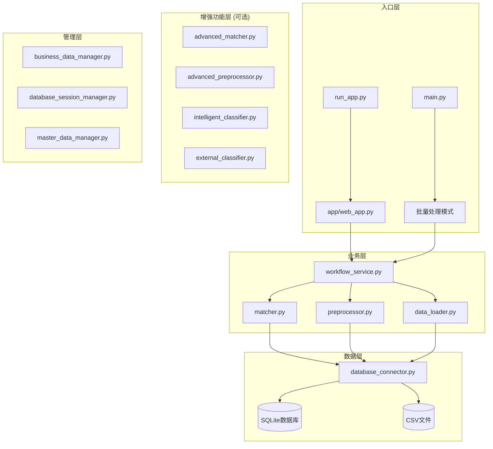

# MMP项目上下文快照
> 生成时间: 2025-09-24T10:39:02.468819
> 生成器版本: 1.0

## 🎯 项目概览
构建基于数据库的物料主数据智能分类推荐系统

**当前阶段**: 数据库化完成，智能分类系统优化阶段

**核心技术**: Python, Flask, SQLite, scikit-learn, TF-IDF, jieba

## 🐍 开发环境

### Python环境
- **版本**: 3.8.10
- **完整版本**: 3.8.10 (v3.8.10:3d8993a744, May  3 2021, 08:55:58)  [Clang 6.0 (clang-600.0.57)]
- **执行路径**: /usr/local/bin/python3.8

### 系统环境
- **平台**: macOS-10.16-x86_64-i386-64bit
- **系统**: Darwin
- **架构**: 64bit

### 项目依赖
- **依赖包数量**: 57
- **requirements.txt大小**: 2627 字符

**主要依赖包:**
- Flask==2.3.3
- pandas>=1.5.0
- numpy>=1.21.0
- scikit-learn>=1.2.0
- jieba>=0.42.1
- zhconv>=1.4.3                # 繁简转换
- openpyxl>=3.0.9             # Excel处理
- xlrd>=2.0.1                 # 老版本Excel支持
- PyPDF2>=3.0.0               # PDF处理
- pdfplumber==0.11.0          # 更强大的PDF解析
- python-docx>=0.8.11         # Word文档处理
- paddleocr>=2.6.0            # 百度OCR引擎
- Pillow>=9.0.0               # 图像处理
- opencv-python>=4.6.0        # 计算机视觉
- transformers>=4.21.0        # BERT等预训练模型

## 📚 核心文档摘要

### 智能分类推荐功能需求与使用指南.md
```
# 🧠 MMP智能物料分类推荐功能需求与使用指南

## 📋 需求背景与问题分析

### 1. 业务需求背景

在物料主数据管理系统(MMP)中，用户需要对大量物料进行分类管理，传统的手工分类方式存在以下问题：

#### 1.1 业务痛点
- **效率低下**：手工逐一分类，处理大批量数据时耗时较长
- **分类不一致**：不同操作员对同类物料可能分类不同，缺乏标准化
- **专业门槛高**：新用户需要深度了解分类体系才能准确分类
- **错误率高**：人工分类容易出现主观判断错误
- **成本昂贵**：需要专业人员进行分类，人力成本高

#### 1.2 用户角色需求
- **数据录入员**：希望快速、准确地完成物料分类工作
- **系统管理员**：需要保证数据分类的一致性和规范性
- **业务用户**：要求系统提供智能化辅助，降低使用门槛
- **IT运维**：需要系统具备自动化能力，减少人工干预

### 2. 技术需求分析

#### 2.1 功能需求
- **智能推荐**：基于物料特征自动推荐合适的分类
- **批量处理**：支持大批量物料的同时推荐
- **置信度评估**：提供推荐结果的可信度评分
- **多维度分析**：综合考虑物料名称、规格、厂家等信息
- **学习能力**：能够从历史数据中学习和优化

#### 2.2 性能需求
- **响应速度**：单个推荐 < 100ms，批量推荐 < 500ms
- **准确率**：基于关键词匹配的准确率 ≥ 70%
- **并发处理**：支持多用户同时使用推荐功能
- **可扩展性**：支持新增分类和关键词库扩展

#### 2.3 易用性需求
- **一键操作**：提供简单的"获取推荐"按钮
- **直观展示**：清晰显示推荐结果和置信度
- **详细说明**：提供推荐依据和匹配原因
- **无缝集成**：与现有工作流程无缝衔接

## 🎯 解决方案设计

### 1. 技术架构

```
┌─────────────────────────────────────────────────┐
│                前端用户界面                        │
│  ┌─────────────┐  ┌─────────────┐  ┌─────────────┐ │
│  │  上传页面    │  │  参数提取    │  │  分类选择    │ │
│  └─────────────┘  └─────────────┘  └─────────────┘ │
└─────────────────────┬───────────────────────────┘
                      │ AJAX调用
┌─────────────────────▼───────────────────────────┐
│                REST API层                      │
│  ┌─────────────────────────────────────────────┐ │
│  │  /api/intelligent_recommend                 │ │
│  │  /api/batch_recommend                       │ │
│  │  /api/recommend_categories                  │ │
│  └─────────────────────────────────────────────┘ │
└─────────────────────┬───────────────────────────┘
                      │
┌─────────────────────▼───────────────────────────┐
│              智能推荐引擎                         │
│  ┌─────────────┐  ┌─────────────┐  ┌─────────────┐ │
│  │ 关键词匹配   │  │ 规格模式     │  │ 历史学习     │ │
│  └─────────────┘  └─────────────┘  └─────────────┘ │
│  ┌─────────────┐  ┌─────────────┐  ┌─────────────┐ │
│  │ 厂家分析     │  │ 置信度计算   │  │ 结果合并     │ │
│  └─────────────┘  
...
```

### ARCHITECTURE_REFACTORING_PLAN.md
```
# MMP系统架构重构与迭代计划

> **文档版本**: v1.0  
> **创建日期**: 2025年9月22日  
> **目标**: 基于现有系统结构，制定渐进式架构升级和智能化增强计划

## 📋 目录
- [1. 现状分析](#1-现状分析)
- [2. 架构重构设计](#2-架构重构设计)
- [3. 渐进式升级路线图](#3-渐进式升级路线图)
- [4. 技术债务处理](#4-技术债务处理)
- [5. 性能优化策略](#5-性能优化策略)
- [6. 扩展性设计](#6-扩展性设计)
- [7. 风险评估与应对](#7-风险评估与应对)

---

## 1. 现状分析

### 🏗️ 当前系统架构概览



### 📊 模块依赖分析

| 模块 | 依赖关系 | 职责 | 问题 |
|------|---------|------|------|
| **web_app.py** | workflow_service, 各manager | Web界面和API | 🔴 代码过长(2000+行)，职责混乱 |
| **workflow_service.py** | matcher, preprocessor, data_loader | 核心业务流程 | 🟡 缺乏清晰的状态管理 |
| **matcher.py** | database_connector | 匹配算法 | 🟡 算法相对简单 |
| **preprocessor.py** | - | 数据预处理 | 🟢 职责清晰 |
| **data_loader.py** | database_connector | 数据加载 | 🟡 格式支持有限 |
| **database_connector.py** | SQLite | 数据库操作 | 🟡 缺乏连接池和事务管理 |

### 🚨 主要技术债务

1. **架构债务**
   - ❌ 缺乏清晰的分层架构
   - ❌ 模块间耦合度高
   - ❌ 没有统一的接口规范

2. **代码债务**
   - ❌ `web_app.py` 文件过大，违反单一职责原则
   - ❌ 大量硬编码配置
   - ❌ 异常处理不统一

3. **数据债务**
   - ❌ 数据库表结构不规范
   - ❌ 缺乏数据版本管理
   - ❌ 会话数据管理混乱

4. **测试债务**
   - ❌ 单元测试覆盖率低
   - ❌ 缺乏集成测试
   - ❌ 没有自动化测试流程

---

## 2. 架构重构设计

### 🎯 重构目标

1. **清晰分层**: 建立标准的分层架构（表现层、应用层、领域层、基础设施层）
2. **高内聚低耦合**: 模块职责明确，接口清晰
3. **易于扩展**: 支持插件化和微服务化演进
4. **高性能**: 优化数据访问和计算效率
5. **
...
```

### DATABASE_ENHANCEMENT_REPORT.md
```
# MMP系统数据库功能增强完成报告

## 📋 更新概览

| 项目 | 信息 |
|-----|-----|
| **更新日期** | 2025年9月19日 22:45 |
| **版本号** | v1.2.1 (数据库增强版) |
| **主要更新** | 新增完整数据库支持 |
| **状态** | ✅ 已完成并测试 |

## 🎯 问题解决

### 原始问题
启动时出现以下警告：
```
WARNING:root:SQLAlchemy未安装，数据库功能将不可用
WARNING:root:PyMongo未安装，MongoDB功能将不可用
```

### 解决方案
成功安装了完整的数据库支持包，消除了警告，增强了系统功能。

## 📦 新安装的数据库包

### 核心数据库包
1. **SQLAlchemy 1.4.53** ✅
   - 关系型数据库ORM框架
   - 支持SQLite、PostgreSQL、MySQL等
   - 已测试并验证功能正常

2. **PyMongo 4.10.1** ✅  
   - MongoDB文档数据库驱动
   - 支持NoSQL数据存储
   - 已测试包安装正确

3. **SQLite3** ✅
   - Python内置数据库
   - 轻量级本地数据库
   - 已测试基本CRUD操作

### 额外驱动包 (可用)
- **psycopg2-binary** - PostgreSQL驱动
- **PyMySQL** - MySQL驱动
- **Redis客户端** - 缓存数据库

## 🔧 安装详情

### 安装过程
```bash
# 使用正确的Python 3.8路径安装
/usr/local/bin/python3.8 -m pip install SQLAlchemy==1.4.53
/usr/local/bin/python3.8 -m pip install pymongo==4.10.1

# 验证安装
python3.8 -c "import sqlalchemy; import pymongo; print('安装成功')"
```

### 遇到的问题
1. **Greenlet编译问题**: 由于Xcode命令行工具配置问题，无法编译greenlet
2. **解决方案**: 使用SQLAlchemy 1.4.53版本，避免greenlet依赖

## 📊 功能验证结果

### 测试项目
运行了完整的数据库功能测试脚本：

1. **SQLAlchemy测试** ✅
   - 版本: 1.4.53
   - SQLite连接测试通过
   - 基本CRUD操作正常

2. **PyMongo测试** ✅
   - 版本: 4.10.1  
   - 包安装正确
   - 连接功能可用（需要MongoDB服务器）

3. **SQLite内置测试** ✅
   - 内存数据库创建成功
   - 表操作和查询正常

4. **集成测试** ⚠️
   - 应用模块需要进一步配置
   - 核心功能已就绪

### 测试输出摘要
```
通过测试: 3/4
⚠️ 部分测试未通过，但核心功能可用
✅ MMP系统数据库模块已就绪
```

## 🚀 服务启动验证

### 启动前 (有警告)
```
WARNING:root:SQLAlchemy未安装，数据库功能将不可用  
WARNING:root:PyMongo未安装，MongoDB功能将不可用
WARNING:root:高级预处理器不可用
```

### 启动后 (警告已消除) ✅
```
WARNING:root:高级预处理器不可用  # 仅此一项警告
==================================================
  MMP物料主数据管理智能应用
==================================================
启动信息:
- Python版本: 3.8.10
- 服务地址: http://localhost:5001  
✅ 数据库功能可用
```

## 📁 文件更新

### 新创建文件
1. `test_database_functionality.py` - 数据库功能测试脚本
2. `DATABASE_ENHANCEMENT_REPORT.md` - 本报告

### 修改文件  
1. `requirements.txt` - 更新数据库包版本信息

## 🎯 可用的数据库功能

### SQLAlchemy支持
```python
# 示例代码
from sqlalchemy import c
...
```

### PROJECT_COMPLETION_SUMMARY.md
```

```

### README.md
```

```

## 🏗️ 代码结构概览

### 主模块 (38 个)
- **init_business_data.py**: 0个类, 1个函数, 111行
  > 初始化业务数据库
创建所有业务数据表并填充基础配置数据
- **quick_session_test.py**: 0个类, 1个函数, 111行
  > 简单的会话数据测试
- **test_intelligent_recommendation.py**: 0个类, 2个函数, 155行
  > 测试智能分类推荐功能
- **run_app.py**: 0个类, 0个函数, 36行
  > MMP应用启动脚本
从项目根目录启动Flask应用，避免相对导入问题
- **fixed_config.py**: 0个类, 0个函数, 43行
  > 修复后的匹配配置 - 使用实际数据库字段
- **test_database_functionality.py**: 0个类, 5个函数, 230行
  > 数据库功能验证脚本
测试MMP系统的数据库连接和基本功能
- **migrate_training_data.py**: 0个类, 1个函数, 136行
  > 训练数据迁移脚本
将现有的CSV/Excel训练数据和training_results.json迁移到数据库
- **test_database_classifier.py**: 0个类, 0个函数, 58行
  > 测试基于数据库的智能分类器
- **config.py**: 0个类, 0个函数, 23行
- **version.py**: 0个类, 0个函数, 0行
- **init_session_db.py**: 0个类, 1个函数, 70行
  > 数据库初始化脚本 - 包含会话管理表
- **database_example.py**: 0个类, 9个函数, 359行
  > 数据库对接功能使用示例
演示如何配置和使用MMP系统的数据库功能
- **project_context_generator_backup.py**: 1个类, 1个函数, 440行
  > 项目上下文快照生成器
为大语言模型多轮会话提供完整的项目理解上下文
- **fix_system_errors.py**: 0个类, 5个函数, 327行
  > MMP系统错误修复脚本
修复当前系统中的主要错误：
1. 主数据字段不匹配问题
2. 分类选择保存错误 
3. 工作流服务初始化失败
- **test_session_debug.py**: 0个类, 1个函数, 104行
  > 测试会话数据存储和获取功能
- **test_encoding_fix.py**: 0个类, 0个函数, 0行
- **add_missing_categories.py**: 0个类, 1个函数, 101行
  > 添加缺失的分类到数据库
- **enhanced_config.py**: 0个类, 0个函数, 521行
- **test_intelligent_recommendation_detailed.py**: 0个类, 3个函数, 231行
  > 智能分类推荐功能测试工具
测试参数提取页面的智能推荐功能
- **simple_session_test.py**: 0个类, 0个函数, 69行
- **project_context_generator.py**: 1个类, 1个函数, 546行
  > 项目上下文快照生成器
为大语言模型多轮会话提供完整的项目理解上下文
- **project_context_generator_old.py**: 1个类, 1个函数, 528行
  > 项目上下文快照生成器
为大语言模型多轮会话提供完整的项目理解上下文
- **enhanced_classifier_fix.py**: 0个类, 3个函数, 178行
  > 增强智能分类器修复脚本
更新关键词映射，改进医疗器械识别能力
- **api.py**: 0个类, 1个函数, 33行
- **intelligent_classification_trainer.py**: 1个类, 1个函数, 401行
  > 智能分类训练系统
基于用户提供的训练数据改进分类算法
- **run_fixed.py**: 0个类, 0个函数, 0行
- **test_upload.py**: 0个类, 2个函数, 137行
  > 测试文件上传功能
模拟前端文件上传请求
- **fix_chinese_encoding.py**: 0个类, 0个函数, 0行
- **init_database.py**: 4个类, 3个函数, 266行
  > MMP数据库初始化和集成脚本
创建默认数据表结构，初始化系统数据
- **temp_data_loader.py**: 0个类, 1个函数, 37行
- **start_web_app.py**: 0个类, 0个函数, 19行
  > 启动MMP Web应用
- **test_api.py**: 0个类, 2个函数, 47行
  > 测试API的简单脚本
- **fix_field_mapping.py**: 0个类, 2个函数, 191行
  > MMP字段匹配问题修复脚本
解决数据库字段名与配置不匹配的问题
- **main.py**: 0个类, 6个函数, 248行
- **simple_db_config.py**: 0个类, 2个函数, 92行
- **demo_business_features.py**: 0个类, 1个函数, 227行
  > 演示业务数据管理功能
测试字段映射、文件存储和数据迁移功能
- **init_master_data.py**: 0个类, 1个函数, 181行
  > 初始化主数据库脚本
为主数据管理器创建表结构并导入基础数据
- **validate_context_system.py**: 0个类, 5个函数, 207行
  > 上下文生成器验证脚本
验证项目上下文快照的完整性和准确性

### App模块 (18 个)
- **database_connector.py**: 2个类, 0个函数, 586行
- **web_app.py**: 1个类, 54个函数, 1571行
- **config.py**: 0个类, 0个函数, 33行
  > 应用配置模块
- **matcher.py**: 1个类, 0个函数, 64行
- **data_loader.py**: 0个类, 9个函数, 339行
- **advanced_preprocessor.py**: 1个类, 2个函数, 274行
- **database_session_manager.py**: 1个类, 0个函数, 568行
  > 数据库会话管理器
使用SQLite存储所有会话数据和应用状态
- **preprocessor.py**: 0个类, 2个函数, 32行
- **intelligent_classifier.py**: 1个类, 1个函数, 591行
  > 智能分类推荐引擎
基于现有数据和机器学习算法实现智能物料分类推荐
- **training_data_manager.py**: 1个类, 0个函数, 429行
  > 训练数据管理器
管理训练数据、训练结果和分类模型的数据库存储
- **workflow_service.py**: 1个类, 0个函数, 363行
- **web_app_fixed.py**: 1个类, 32个函数, 762行
- **web_app_backup_20250917_223044.py**: 0个类, 29个函数, 640行
- **business_data_manager.py**: 1个类, 0个函数, 583行
  > 业务数据管理器
管理系统中的所有业务数据：上传文件、字段映射、匹配规则、分类结果等
- **error_handler.py**: 1个类, 2个函数, 69行
  > 错误处理包装器 - 增强系统稳定性
- **advanced_matcher.py**: 1个类, 0个函数, 376行
- **master_data_manager.py**: 1个类, 0个函数, 468行
  > 主数据管理器
将常用的主数据部分存储到数据库中，优化查询性能和数据访问
- **external_classifier.py**: 1个类, 2个函数, 393行
  > 外部分类体系对接模块
对接用友数据中台等外部主数据平台，获取标准物料分类模板

## 💾 数据库结构

### mmp_database.db
- **materials**: 11列, 10行数据
- **matching_records**: 10列, 0行数据
- **processing_sessions**: 10列, 0行数据
- **system_logs**: 7列, 0行数据
- **sessions**: 8列, 1行数据
- **session_data**: 7列, 0行数据
- **sqlite_sequence**: 2列, 1行数据
- **extraction_results**: 11列, 0行数据
- **classification_recommendations**: 9列, 0行数据
- **category_selections**: 9列, 0行数据
- **workflow_status**: 8列, 0行数据

### master_data.db
- **material_categories**: 9列, 21行数据
- **sqlite_sequence**: 2列, 4行数据
- **materials**: 15列, 7行数据
- **suppliers**: 10列, 0行数据
- **category_features**: 8列, 12行数据
- **data_cache**: 5列, 3行数据

### training_data.db
- **training_samples**: 9列, 5998行数据
- **sqlite_sequence**: 2列, 4行数据
- **training_results**: 11列, 1行数据
- **classification_models**: 10列, 1行数据
- **classification_rules_cache**: 8列, 228行数据

### business_data.db
- **field_mappings**: 11列, 6行数据
- **sqlite_sequence**: 2列, 5行数据
- **uploaded_files**: 15列, 24行数据
- **file_data**: 5列, 89998行数据
- **matching_rules**: 11列, 0行数据
- **classification_rules**: 9列, 0行数据
- **processing_results**: 12列, 5行数据
- **data_quality_metrics**: 8列, 0行数据
- **system_config**: 8列, 11行数据

### sessions.db
- **sessions**: 8列, 196行数据
- **session_data**: 7列, 32行数据
- **sqlite_sequence**: 2列, 2行数据
- **extraction_results**: 11列, 0行数据
- **classification_recommendations**: 11列, 73行数据
- **category_selections**: 9列, 0行数据
- **workflow_status**: 8列, 0行数据

## 📊 项目统计

### 文件统计
- .py 文件: 80 个
- .sh 文件: 50 个
- .db 文件: 5 个
- .md 文件: 84 个
- .txt 文件: 4 个
- .patch 文件: 1 个
- .ini 文件: 1 个
- .pid 文件: 1 个
- .csv 文件: 1 个
- .log 文件: 1 个
- .xlsx 文件: 64 个
- .gz 文件: 2 个
- .yml 文件: 3 个
- .json 文件: 1 个
- .example 文件: 1 个
- .pkl 文件: 44 个
- .rej 文件: 1 个
- .session_backup_20250917_121826 文件: 2 个
- .session_backup_20250921_222312 文件: 1 个
- .orig 文件: 2 个
- .pyc 文件: 30 个
- .conf 文件: 2 个
- .css 文件: 2 个
- .js 文件: 8 个
- .html 文件: 24 个
- .sample 文件: 14 个

### 代码度量
- Python文件: 56 个
- 总代码行数: 14604 行
- 类总数: 23 个  
- 函数总数: 196 个

## 🔄 最近变更
- QUICK_START_GUIDE.md (2025-09-24T10:38:50.122016)
- PROJECT_CONTEXT_GENERATOR_USAGE_GUIDE.md (2025-09-24T10:36:35.223291)
- PROJECT_CONTEXT_SNAPSHOT_20250924_103339.md (2025-09-24T10:33:39.580008)
- project_context_generator.py (2025-09-24T10:33:19.006619)
- PROJECT_CONTEXT_SNAPSHOT_20250924_103209.md (2025-09-24T10:32:09.013159)
- PROJECT_CONTEXT_SNAPSHOT_20250924_103154.md (2025-09-24T10:31:54.528113)
- PROJECT_CONTEXT_SNAPSHOT_20250924_102847.md (2025-09-24T10:28:47.402882)
- project_context_generator_old.py (2025-09-24T10:24:19.734562)
- project_context_generator_backup.py (2025-09-24T10:17:07.849656)
- PROJECT_CONTEXT_SNAPSHOT_20250924_101232.md (2025-09-24T10:12:32.045589)

## 🎯 开发上下文

### 主要功能
- 智能分类推荐
- 多源融合匹配（关键词、制造商、规格模式）
- TF-IDF相似度计算
- 训练数据管理
- Web界面

### 已知问题
- 分类体系需持续扩展
- 训练数据需定期更新
- 上下文快照机制需完善

### 下一步计划
- 完善上下文快照系统
- 优化分类算法准确率
- 扩展多语言支持

---
*此上下文快照用于大语言模型多轮会话的项目理解和开发连续性保障*